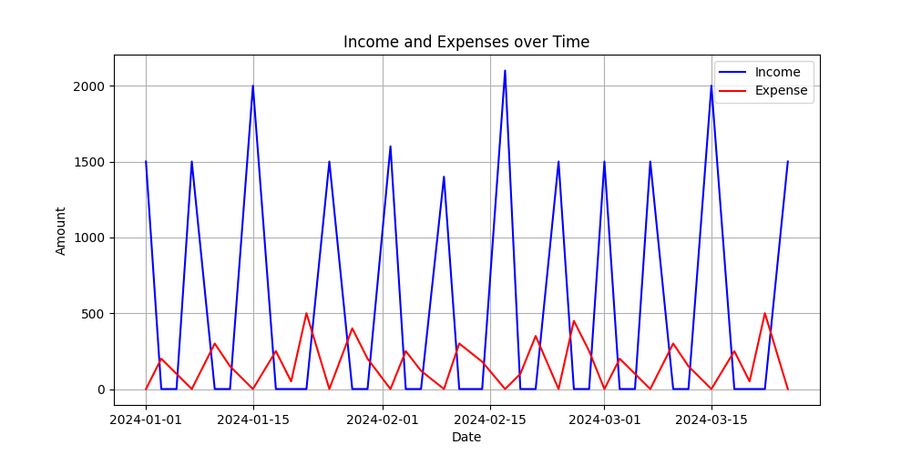

# Personal_Finance_Tracker

## Overview

This Personal Finance Tracker is a Python application designed to help users manage and analyze their financial transactions. It allows users to add transactions, view transaction summaries, and visualize income and expenses over time. The project also incorporates machine learning to predict future expenses based on historical data. The application includes a main file as well as a helper file with a variety of functions. Current data is transaction_data CSV file is derived from ChatGPT.

## Features

- **Add Transactions**: Enter details of income and expenses, including date, amount, category, and description.
- **View Transactions**: Retrieve and view transactions within a specified date range along with a summary of total income, expenses, and net savings.
- **Visualize Data**: Generate plots to visualize income and expenses over time.
- **Predict Future Expenses**: Use machine learning models to predict future expenses based on historical transaction data.

## Requirements

To run this project, you'll need the following Python libraries:

- `pandas`
- `numpy`
- `matplotlib`
- `scikit-learn` (for machine learning)

You can install these libraries using pip:

```bash
pip install pandas numpy matplotlib scikit-learn
```
## Example usage

### Start Application


### Add New Transaction


### View Transactions and Summary within a Range of Dates




### Predict future expenses


### Exit Application


